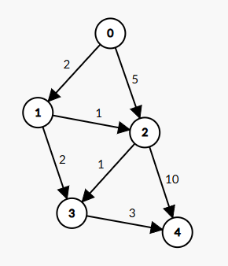
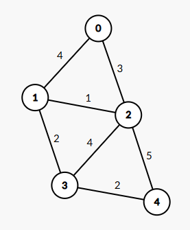
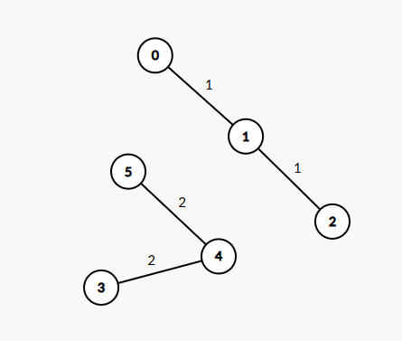
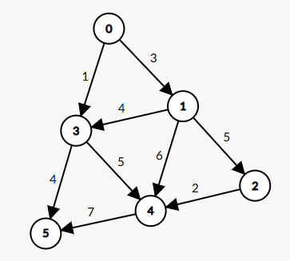

## Три проекта по теории графов, каждый в своей папочке (но зависимости общие)

В лабе на 3 старался держать код по задаче (класс, алгоритмы) максимально простым
В лабе на 4 

### Запуск

```bash
# зависимости
mise run i

# программы
mise 3
mise 4 -- [OPTIONS] COMMAND [ARGS]...
mise 5
```

или

```bash
# виртуальное окружение
python3 -m venv .venv
source .venv/bin/activate

# зависимости (работа с терминалом)
pip install -r requirements.txt

# запуск
python3 -m lab3
python3 -m lab4 [OPTIONS] COMMAND [ARGS]...
python3 -m lab5
```

## На 3

`mise 3` или `python3 3/main.py`

### Доступные команды:

- `create` - Создать пустой граф
- `load` - Загрузить граф из файла
- `add_vertex` - Добавить вершину
- `add_edge` - Добавить ребро
- `remove_vertex` - Удалить вершину
- `remove_edge` - Удалить ребро
- `list_vertices` - Вывести список всех вершин
- `list_edges` - Вывести список всех рёбер
- `connected` - Проверить связность графа
- `components` - Вывести компоненты связности
- `shortest_path` - Найти кратчайший путь между двумя вершинами
- `distances` - Найти расстояния от вершины до всех остальных
- `mst` - Найти минимальное остовное дерево
- `info` - Информация о графе
- `help` - Показать справку
- `exit` - Выйти из программы

### Формат входного файла

Первая строка — количество вершин, далее — рёбра в формате: `вершина1 вершина2 вес`  
Вес может быть вещественным

```
5
0 1 4
0 2
1 2 2.5
1 3 5.9
2 3 4.1
2 4 10
3 4 2
```

Если вес равен 1, то его можно не записывать  
Тогда невзвешенная матрица будет выглядеть так:

```
5
0 1
0 2
1 2
1 3
2 3
2 4
3 4
```

При наличии в файле одинаковых вершин используюется последняя, в остальном порядок вершин не важен

<details>
 <summary>Тестовые графы</summary>

3/test_graphs/directed_shortest_paths.txt  


3/test_graphs/undirected_connected.txt  


3/test_graphs/undirected_disconnected.txt  


3/test_graphs/weighted_mst.txt  


> https://csacademy.com/app/graph_editor/

</details>


### Создание графа из файла

```bash
graph> load
load> Путь к файлу: 3/test_graphs/directed_shortest_paths.txt
    > Тип графа:
      1. неориентированный
   >  2. ориентированный
✓ Ориентированный граф загружен из файла 
3/test_graphs/directed_shortest_paths.txt
╭── Информация о графе ──╮
│ Тип: Ориентированный   │
│ Вершин: 5              │
│ Рёбер: 7               │
│ Связность: Да          │
│ Компонент связности: 1 │
╰────────────────────────╯
```

### Поиск кратчайшего пути

```bash
graph> shortest_path
shortest_path> Начальная вершина: 0
shortest_path> Конечная вершина: 4
╭─ Кратчайший путь от 0 до 4 ─╮
│ Путь: 0 → 1 → 3 → 4         │
│ Расстояние: 7.00            │
╰─────────────────────────────╯
```

### Построение минимального остовного дерева

```bash
graph> mst
mst> Начальная вершина: 0
 Минимальное остовное 
   дерево (алгоритм   
        Прима)        
╭───┬────┬────┬──────╮
│ № │ От │ До │  Вес │
├───┼────┼────┼──────┤
│ 1 │ 0  │ 1  │ 2.00 │
│ 2 │ 1  │ 2  │ 1.00 │
│ 3 │ 2  │ 3  │ 1.00 │
│ 4 │ 3  │ 4  │ 3.00 │
╰───┴────┴────┴──────╯
Общий вес МОД: 7.00
```
